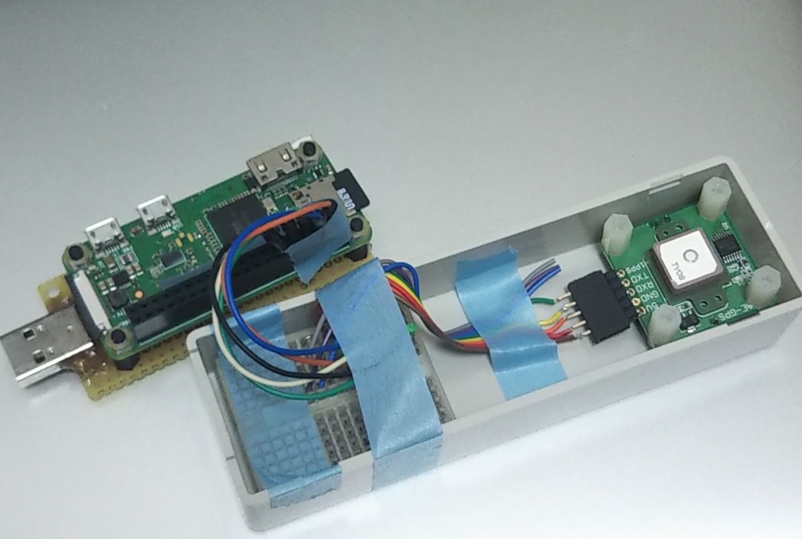
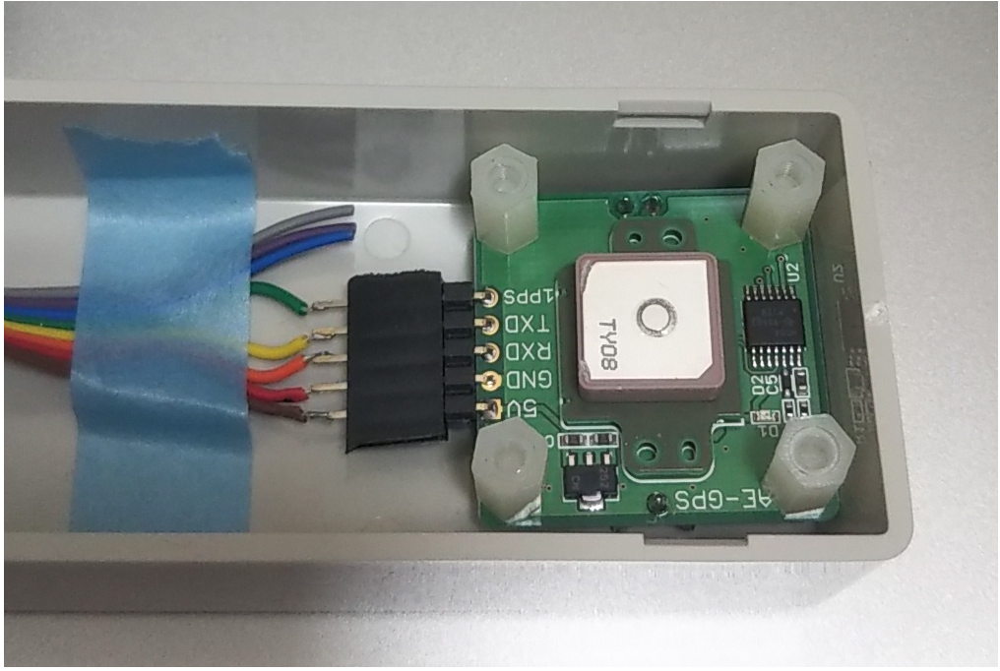

# RaspberryPi-NTP-server

- Develop stratum 1: NPT server with GPS module

### BOM:  
  - Raspberry PI (Zero-W)  
  - GPS module : GYSFDMAXB/AE-GPS  

### Prerequisite  

### Structure  
- GPS with PPS: PPS signal source
- gpsd : GPS signal corrector & provider by IP
- ntpd (or chrony) : NTP server/client
- pps-gpio : module  

### Steps 
1. Configure raspberrypi
   1. sudo apt-get update & apt-get -y upgrade 
3. Configure serial port
   1. Disable Bluetooth or switch serial port assignment
   2. Assign PL0 to serial port 0
   3. Disable ttyS0
4. Connect GPS
5. 

### Reference  

https://gpsd.gitlab.io/gpsd/  
https://gpsd.gitlab.io/gpsd/gpsd-time-service-howto.html  

